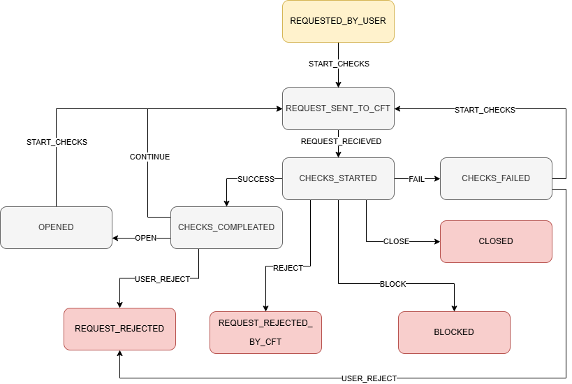

# Bank System Microservices

A backend system for standard banking operations implemented using **Microservices Architecture**. The project simulates real-world banking processes, including account creation, lifecycle management via Finite State Machine, and user administration.

> **Status:** Work in Progress (MVP implemented)

## Tech Stack

- **Language:** Java 17
- **Framework:** Spring Boot 3
- **Architecture:** Microservices (API Gateway)
- **Database:** PostgreSQL (with Liquibase/Flyway migrations)
- **Business Logic:** Spring Statemachine
- **Messaging:** RabbitMQ (Asynchronous operations)
- **Testing:** JUnit 5, Mockito
- **Tools:** Swagger/OpenAPI, Maven/Gradle

## System Architecture

The system is built on the API Gateway pattern and consists of the following services:

| Service | Description |
| :--- | :--- |
| **Gateway Service** | Single entry point for all clients. |
| **User Service** | User registration, authentication, role management, and profile handling. |
| **Account Service** | Core logic for account management: lifecycle (opening, closing, blocking), transaction history. |
| **Card Service** | *[Planned]* Management of debit/credit cards, limits, and blocking. |

## Implementation Status

The project is currently under active development. Below is the breakdown of implemented features vs. planned tasks.

### User Service
- [x] REST API for User Roles management (with `Pageable` sorting/filtering).
- [x] User registration and profile management.
- [x] **Unit Testing:** Full coverage of `UserService` using Mockito (stubbing, verification).

### Account Service
- [x] **Account Lifecycle Management** using **Spring Statemachine**.
- [x] Account creation flow:
    - Database sequence generation for account numbers.
    - Initial status handling (`NONE` -> `REQUESTED_BY_USER`).
- [x] Status transition logic (State Machine actions).
- [x] Account locking/closing logic.
- [x] History logging for status changes.
- [x] Rejection logic (`is_rejected_by_user`).
- [x] REST API for account operations.

### Infrastructure & Future Plans
- [ ] **Card Service implementation.**
- [ ] Full RabbitMQ integration for inter-service notifications.
- [ ] Docker Compose setup for one-click deployment.

## Account Lifecycle (State Machine)

One of the key features is the implementation of a complex lifecycle for bank accounts using **Spring Statemachine**.



**Status Workflow:**
1.  `REQUESTED_BY_USER` — Account creation requested.
2.  `CHECKS_STARTED` / `REQUEST_SENT_TO_CFT` — Internal bank checks.
3.  `CHECKS_COMPLETED` — Checks passed.
4.  `OPENED` — Account successfully opened.
5.  `BLOCKED` / `CLOSED` — Account lifecycle termination.
6.  `REQUEST_REJECTED` — Logic for rejection by bank or user.

*The state machine automatically handles transitions, invokes specific actions (Action Beans), and updates the database state history.*

## Testing Strategy

The project emphasizes quality code.
- **Unit Tests:** Business logic is covered with isolation tests using Mockito.
- **Key Scenarios:**
    - User creation with specific roles.
    - Account opening flow (ensuring State Machine triggers correctly).

## How to Run

1.  **Clone the repository:**
    ```bash
    git clone https://github.com/northbae/bank-system-ed-app.git
    ```
2.  **Setup Database**
3.  **Configure Application:**
    Check `application.yml` in each service for DB credentials.
4.  **Build and Run:**
    Run the services in the following order:
    1.  Gateway Service
    2.  User Service
    3.  Account Service
